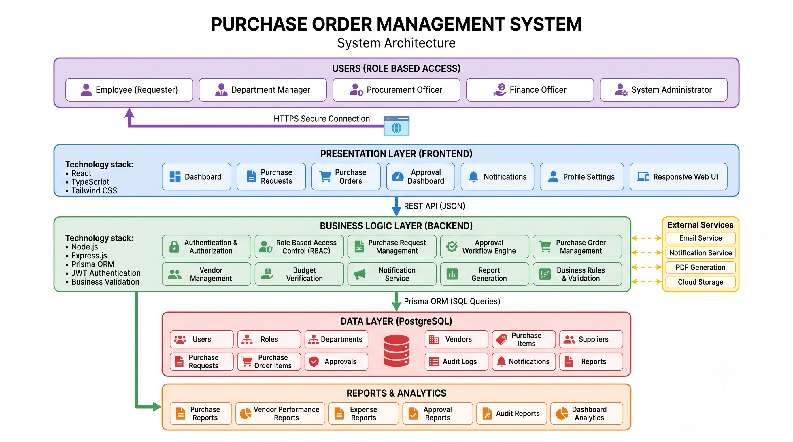

# 📦 Purchase Order Management System (POMS)

> An enterprise-grade procurement and purchase order management web application connecting React, Express, and MySQL.

---

## 🔗 Demo & Video Links

- **Live Demo**: Not deployed yet — planned for Review-II (Local development only for Review-I)
- **Video Demo**: To be added for Review-II

---

## 📑 Table of Contents

- [Overview](#overview)
- [Architecture Diagram](#architecture-diagram)
- [Tech Stack](#tech-stack)
- [Features](#features)
- [Screenshots](#screenshots)
- [Getting Started](#getting-started)
- [Environment Variables](#environment-variables)
- [API Documentation](#api-documentation)
- [Running Tests](#running-tests)
- [Deployment](#deployment)
- [Folder Structure](#folder-structure)
- [Future Enhancements](#future-enhancements)
- [License](#license)
- [Author & Contact](#author--contact)

---

## 🎯 Overview

Manual procurement workflows reliant on static spreadsheets and paper approvals lead to operational bottlenecks, misplaced orders, and untracked inventory levels. **POMS** addresses these challenges through a centralized, role-aware management system that connects procurement actions directly to live inventory and database records.

---

## 🏗 Architecture Diagram



---

## 🛠 Tech Stack

### Frontend

- **Framework**: React 19 + Vite
- **Routing**: React Router 7 (`BrowserRouter`, `Routes`, `Route`, `Navigate`)
- **HTTP Client**: Axios (with custom auth & 401 response interceptors)
- **Icons**: Lucide React
- **Styling**: Custom CSS Enterprise Design System (`index.css`, `poms.css`)

### Backend

- **Runtime**: Node.js
- **Framework**: Express.js
- **Database Driver**: `mysql2/promise` (Connection Pooling)
- **Security**: `bcryptjs` (salted hash comparison), `jsonwebtoken` (JWT signed sessions)
- **Environment**: `dotenv`, `cors` (origin-gated)

### Database

- **Engine**: MySQL 8
- **Database Name**: `purchase_order_db`

---

## ✨ Features

### 🔐 Authentication & Security

- **JWT Authorization**: Token-based security signed by Express backend with 8-hour session expiration.
- **Bcrypt Password Security**: Mandatory `bcrypt.compare` verification for login authentication.
- **Protected Routes**: Client-side route guards ensuring unauthenticated visitors are redirected to login.
- **Global Interceptors**: Automatic bearer token injection on outgoing Axios requests with instant 401 redirect handling.

### 📊 Operations Dashboard

- **Live KPI Analytics**: Aggregated real-time metrics for Total Vendors, Total Products, Total Purchase Orders, and Inventory Stock.
- **Pending & Low-Stock Alerts**: Visual counters highlighting orders awaiting approval and items requiring reorders.
- **Recent PO Activity**: Tabular overview of recent procurement orders with status badges (`Pending`, `Approved`, `Completed`, `Rejected`).
- **Inventory Stock Summary**: Real-time snapshot of product quantities and reorder thresholds.

### 🏢 Core Enterprise Modules

- **Vendors Management**: Supplier directory tracking company details, contact persons, emails, phones, GST numbers, and active status (`GET /api/vendors`).
- **Products Catalog**: Comprehensive product list mapped to vendors with unit prices, units of measurement, and availability status (`GET /api/products`).
- **Purchase Orders**: Lifecycle tracking of orders including order dates, expected delivery dates, total amounts, and status badges (`GET /api/purchase-orders`).
- **Inventory Tracking**: Stock monitoring with automated status calculation (`In Stock`, `Low Stock`, `Reorder Required`) (`GET /api/inventory`).
- **Goods Receipts**: Delivery verification system linking received items to purchase orders and receiving personnel (`GET /api/goods-receipts`).

---

## 📸 Screenshots

> Note: UI screenshots will be captured and documented in the repository for Review-II.

---

## 🚀 Getting Started

Follow these steps to set up and run POMS locally:

### 1. Clone Repository

```bash
git clone https://github.com/nishanthpn006/purchase-order-management-system.git
cd purchase-order-management-system
```

### 2. Database Setup (MySQL 8)

Open MySQL Workbench or your terminal MySQL client and run `database/schema.sql` followed by `database/seed.sql`:

```sql
SOURCE database/schema.sql;
SOURCE database/seed.sql;
```

### 3. Backend Setup

Navigate to the `backend/` directory, create a `.env` file, install dependencies, and start the server:

```bash
cd backend
cp .env.example .env
npm install
node src/server.js
```

### 4. Frontend Setup

In a new terminal window, navigate to the `frontend/` directory, install dependencies, and start the Vite dev server:

```bash
cd frontend
npm install
npm run dev
```

### 5. Access Application

Open [http://localhost:5173](http://localhost:5173) in your browser.

- **Demo Credentials**: `admin@poms.com` / `admin123`

---

## ⚙️ Environment Variables

The backend relies on the following environment variables defined in `.env`:

```env
PORT=5000
DB_HOST=localhost
DB_USER=root
DB_PASSWORD=your_mysql_password
DB_NAME=purchase_order_db
JWT_SECRET=replace_with_a_secure_random_secret
JWT_EXPIRES_IN=8h
FRONTEND_URL=http://localhost:5173
```

---

## 📡 API Documentation

> Note: Swagger/OpenAPI documentation is planned for Review-II.

### Implemented REST Endpoints

| Method | Endpoint | Authentication | Description |
| --- | --- | --- | --- |
| `GET` | `/api/health` | Public | Backend service health check |
| `POST` | `/api/login` | Public | Authenticates user & returns JWT token |
| `GET` | `/api/me` | Protected (JWT) | Validates token & returns user session |
| `GET` | `/api/dashboard/stats` | Protected (JWT) | Returns aggregated KPI counts from MySQL |
| `GET` | `/api/vendors` | Protected (JWT) | Retrieves all registered vendor records |
| `GET` | `/api/products` | Protected (JWT) | Retrieves product catalog joined with vendor names |
| `GET` | `/api/purchase-orders` | Protected (JWT) | Retrieves purchase orders with vendor & creator details |
| `GET` | `/api/inventory` | Protected (JWT) | Retrieves inventory stock joined with product details |
| `GET` | `/api/goods-receipts` | Protected (JWT) | Retrieves goods receipts joined with PO & receiver info |

---

## 🧪 Running Tests

For Review-I, verification is conducted through API smoke scripts and manual frontend integration testing:

- **API Verification**: Executed node scripts validating HTTP status codes and database payloads across all routes.
- **Frontend Verification**: Client-side manual testing verifying login flow, JWT storage, route redirection, dashboard rendering, and module data tables.

---

## 🌐 Deployment

Currently configured for **Local Development**. Production deployment (Render/Vercel) is scheduled for Review-II.

---

## 📁 Folder Structure

```text
purchase-order-management-system/
├── backend/
│   ├── src/
│   │   ├── config/          # MySQL connection pool (db.js)
│   │   ├── controllers/     # Controller business logic
│   │   ├── middlewares/     # JWT authentication middleware
│   │   ├── routes/          # Express route definitions
│   │   └── server.js        # Express app entrypoint
│   ├── .env.example         # Environment template
│   └── package.json
├── frontend/
│   ├── src/
│   │   ├── components/      # Reusable UI components (Sidebar, Navbar, Badges)
│   │   ├── context/         # AuthContext & useAuth custom hook
│   │   ├── pages/           # Application views (Dashboard, Vendors, POs, etc.)
│   │   ├── services/        # Axios API client & endpoints
│   │   ├── styles/          # Enterprise CSS design system (poms.css)
│   │   ├── App.jsx          # Route configuration
│   │   └── main.jsx         # React application root
│   └── package.json
├── database/
│   ├── schema.sql           # MySQL 8 table schema creation script
│   └── seed.sql             # Sample data insertion script
├── diagrams/                # System architecture & ER diagrams
├── docs/                    # Capstone documentation Markdown files
├── .gitignore               # Git ignore rules
├── CHANGELOG.md             # Project changelog
├── LICENSE                  # MIT License
└── README.md                # Project documentation
```

---

## 🔮 Future Enhancements

- **Vendor & Product CRUD**: Interactive creation, updating, and deactivation of vendors and products.
- **Purchase Order Creation Builder**: Multi-item PO builder form with automatic price totals.
- **Goods Receipt Entry Form**: Delivery logger updating inventory stock levels upon receipt verification.
- **PDF Export**: Generate downloadable PDF documents for purchase orders.
- **Audit Logs**: Activity logging tracking system actions and user timestamps.

---

## 📄 License

This project is licensed under the **MIT License**.

---

## 👨‍💻 Author & Contact

**Nishanth P N**  
Pre-Final Year B.Tech Information Technology Student  
J. J. College of Engineering and Technology
