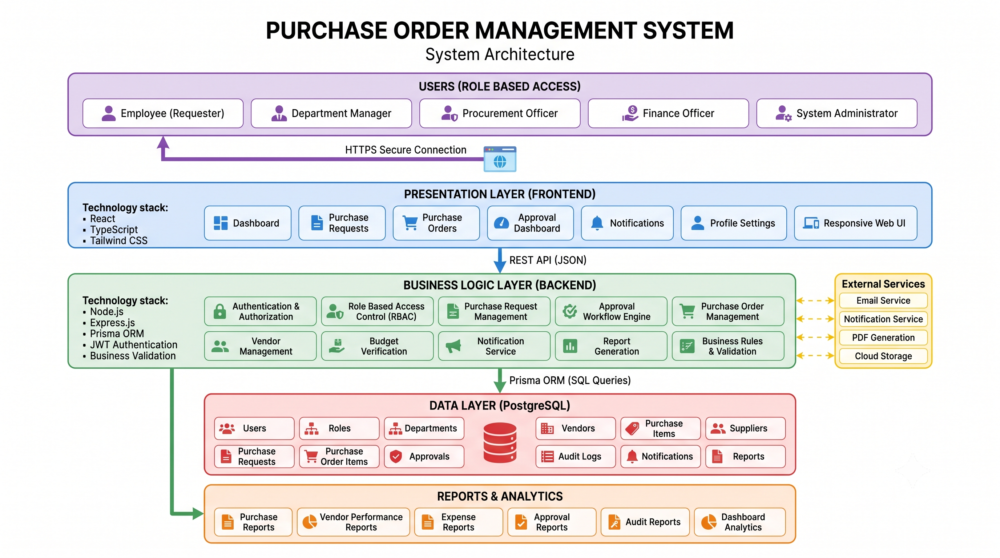

# Purchase Order Management System (POMS)

> An enterprise-grade procurement and purchase order management web application connecting React, Spring Boot, and PostgreSQL.

---

## Demo & Video Links

- **Live Demo**: Planned for production deployment
- **Swagger OpenAPI Docs**: [http://localhost:5000/swagger-ui.html](http://localhost:5000/swagger-ui.html) (when backend is running)

---

## Table of Contents

- [Overview](#overview)
- [Architecture Diagram](#architecture-diagram)
- [Tech Stack](#tech-stack)
- [Features](#features)
- [Screenshots](#screenshots)
- [Getting Started](#getting-started)
- [Configuration](#configuration)
- [API Documentation](#api-documentation)
- [Running Tests](#running-tests)
- [Deployment](#deployment)
- [Folder Structure](#folder-structure)
- [Future Enhancements](#future-enhancements)
- [License](#license)
- [Author & Contact](#author--contact)

---

## Overview

Manual procurement workflows reliant on static spreadsheets and paper approvals lead to operational bottlenecks, misplaced orders, and untracked inventory levels. **POMS** addresses these challenges through a centralized, role-aware management system that connects procurement actions directly to live inventory and database records.

---

## Architecture Diagram



---

## Tech Stack

### Frontend

- **Framework**: React 19 + Vite
- **Routing**: React Router 7 (`BrowserRouter`, `Routes`, `Route`, `Navigate`)
- **HTTP Client**: Axios (with custom auth & 401 response interceptors)
- **Icons**: Lucide React
- **Styling**: Custom CSS Enterprise Design System (`index.css`, `poms.css`)

### Backend

- **Runtime & Language**: Java 21
- **Framework**: Spring Boot 3
- **ORM & Data**: Spring Data JPA / Hibernate
- **Security**: Spring Security + JJWT (JSON Web Token signed sessions)
- **API Documentation**: SpringDoc OpenAPI 3 / Swagger UI
- **Build Tool**: Maven with Maven Wrapper (`mvnw` / `mvnw.cmd`)

### Database

- **Engine**: PostgreSQL
- **Database Name**: `purchase_order_db`
- **Default Schema**: `public`

---

## Features

### Authentication & Security

- **JWT Authorization**: Token-based security signed by Spring Boot backend with role claim and session expiration.
- **BCrypt Password Security**: Salting and hash verification for user authentication.
- **Protected Routes**: Client-side route guards ensuring unauthenticated visitors are redirected to login.
- **Global Interceptors**: Automatic bearer token injection on outgoing Axios requests with instant 401 redirect handling.

### Operations Dashboard

- **Live KPI Analytics**: Aggregated real-time metrics for Total Vendors, Total Products, Total Purchase Orders, and Inventory Stock.
- **Pending & Low-Stock Alerts**: Visual counters highlighting orders awaiting approval and items requiring reorders.
- **Recent PO Activity**: Tabular overview of recent procurement orders with status badges (`Pending`, `Approved`, `Completed`, `Rejected`).
- **Inventory Stock Summary**: Real-time snapshot of product quantities and reorder thresholds.

### Core Enterprise Modules

- **Vendors Management**: Supplier directory tracking company details, contact persons, emails, phones, GST numbers, and active status (`GET /api/vendors`).
- **Products Catalog**: Comprehensive product list mapped to vendors with unit prices, units of measurement, and availability status (`GET /api/products`).
- **Purchase Orders**: Lifecycle tracking of orders including order dates, expected delivery dates, total amounts, item lines, and status badges (`GET /api/purchase-orders`, `POST /api/purchase-orders`, `PATCH /api/purchase-orders/{id}/status`).
- **Inventory Tracking**: Stock monitoring with automated status calculation (`In Stock`, `Low Stock`, `Reorder Required`) (`GET /api/inventory`).
- **Goods Receipts**: Delivery verification system linking received items to purchase orders and receiving personnel (`GET /api/goods-receipts`).

---

## Screenshots

> Note: UI screenshots will be captured and documented in the repository for Review-II.

---

## Getting Started

Follow these steps to set up and run POMS locally:

### 1. Clone Repository

```bash
git clone https://github.com/nishanthpn006/purchase-order-management-system.git
cd purchase-order-management-system
```

### 2. Database Setup (PostgreSQL)

Create the `purchase_order_db` database in PostgreSQL and initialize the schema and seed scripts:

```bash
psql -U postgres -d purchase_order_db -f database/schema.sql
psql -U postgres -d purchase_order_db -f database/seed.sql
```

### 3. Backend Setup (Spring Boot)

Navigate to the `backend/` directory, verify configuration in `src/main/resources/application.properties`, and start the Spring Boot service:

```bash
cd backend
./mvnw spring-boot:run
# On Windows PowerShell:
# .\mvnw.cmd spring-boot:run
```

The backend server runs on `http://localhost:5000`. Swagger documentation is available at `http://localhost:5000/swagger-ui.html`.

### 4. Frontend Setup (React + Vite)

In a new terminal window, navigate to the `frontend/` directory, install dependencies, and start the Vite dev server:

```bash
cd frontend
npm install
npm run dev
```

### 5. Access Application

Open [http://localhost:5173](http://localhost:5173) in your browser.

- **Demo Credentials**: `nishanth@poms.com` / `admin123`

---

## Configuration

The backend configuration is managed via `backend/src/main/resources/application.properties`:

- **Port**: `server.port=5000`
- **Datasource**: PostgreSQL connection details (`spring.datasource.url`, `username`, `password`)
- **JPA / Hibernate**: DDL and dialect settings
- **JWT**: `jwt.secret` and expiration duration
- **Swagger / OpenAPI**: Path endpoints at `/swagger-ui.html` and `/v3/api-docs`

---

## API Documentation

Interactive Swagger OpenAPI documentation is integrated directly into the Spring Boot backend:

- **Swagger UI**: [http://localhost:5000/swagger-ui.html](http://localhost:5000/swagger-ui.html)
- **OpenAPI JSON Spec**: [http://localhost:5000/v3/api-docs](http://localhost:5000/v3/api-docs)

### Core REST Endpoints

| Method | Endpoint | Authentication | Description |
| --- | --- | --- | --- |
| `POST` | `/api/login` | Public | Authenticates user & returns JWT token |
| `GET` | `/api/me` | Protected (JWT) | Validates token & returns authenticated user session |
| `GET` | `/api/dashboard/stats` | Protected (JWT) | Returns aggregated KPI counts and alerts |
| `GET` | `/api/vendors` | Protected (JWT) | Retrieves all registered vendor records |
| `GET` | `/api/vendors/{id}` | Protected (JWT) | Retrieves single vendor by ID |
| `GET` | `/api/products` | Protected (JWT) | Retrieves product catalog |
| `GET` | `/api/products/{id}` | Protected (JWT) | Retrieves single product by ID |
| `GET` | `/api/purchase-orders` | Protected (JWT) | Retrieves all purchase orders |
| `GET` | `/api/purchase-orders/{id}` | Protected (JWT) | Retrieves purchase order details and items |
| `POST` | `/api/purchase-orders` | Protected (JWT) | Creates new purchase order with line items |
| `PATCH` | `/api/purchase-orders/{id}/status` | Protected (Admin/Manager) | Updates status (`Pending`, `Approved`, `Completed`, `Rejected`) |
| `GET` | `/api/inventory` | Protected (JWT) | Retrieves inventory stock records |
| `GET` | `/api/goods-receipts` | Protected (JWT) | Retrieves goods receipts delivery records |

---

## Running Tests

Automated testing is implemented for both the backend service layer and frontend components:

### Backend Tests (JUnit 5 & Mockito)

```bash
cd backend
./mvnw test
# Or full clean verify:
./mvnw clean verify
```

### Frontend Lint & Build

```bash
cd frontend
npm run lint
npm run build
```

---

## Deployment

Currently configured for **Local Development**. Production deployment is scheduled for Review-II.

---

## Folder Structure

```text
purchase-order-management-system/
├── backend/                  # Spring Boot 3 + Java 21 REST API
│   ├── .mvn/                # Maven wrapper binaries & properties
│   ├── src/
│   │   ├── main/java/com/poms/backend/
│   │   │   ├── config/      # Swagger OpenAPI configuration
│   │   │   ├── controller/  # REST controllers
│   │   │   ├── dto/         # Request & response DTOs
│   │   │   ├── entity/      # JPA entities
│   │   │   ├── repository/  # Spring Data JPA repositories
│   │   │   ├── security/    # JWT filter, provider, security configuration
│   │   │   └── service/     # Business logic services
│   │   ├── main/resources/  # application.properties
│   │   └── test/java/com/poms/backend/ # JUnit 5 + Mockito service test suite
│   ├── mvnw / mvnw.cmd      # Maven wrapper executable scripts
│   └── pom.xml              # Maven dependency descriptor
├── frontend/                 # React 19 + Vite web client
│   ├── src/
│   │   ├── components/      # Reusable UI components (Sidebar, Navbar, Badges)
│   │   ├── context/         # AuthContext & useAuth custom hook
│   │   ├── pages/           # Application views (Dashboard, Vendors, POs, etc.)
│   │   ├── services/        # Axios API client & endpoints
│   │   ├── styles/          # Enterprise CSS design system (poms.css)
│   │   ├── App.jsx          # Route configuration
│   │   └── main.jsx         # React application root
│   └── package.json
├── database/                 # Database schema & seed SQL scripts
├── diagrams/                 # System architecture & ER diagrams
├── docs/                     # Capstone documentation
├── CHANGELOG.md              # Project changelog
├── LICENSE                   # MIT License
└── README.md                 # Project documentation
```

---

## Future Enhancements

- **Vendor & Product CRUD**: Interactive creation, updating, and deactivation of vendors and products.
- **Purchase Order Creation Builder**: Multi-item PO builder form with automatic price totals.
- **Goods Receipt Entry Form**: Delivery logger updating inventory stock levels upon receipt verification.
- **PDF Export**: Generate downloadable PDF documents for purchase orders.
- **Audit Logs**: Activity logging tracking system actions and user timestamps.

---

## License

This project is licensed under the **MIT License**.

---

## Author & Contact

**Nishanth P N**  
Pre-Final Year B.Tech Information Technology Student  
J. J. College of Engineering and Technology
