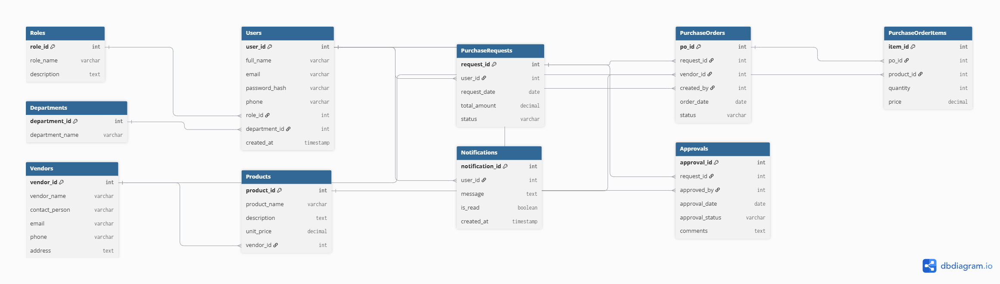

# Database Design

## Introduction

The Purchase Order Management System (POMS) uses a relational database to manage users, purchase requests, approvals, vendors, products, and purchase orders. PostgreSQL is selected as the database management system because of its reliability, scalability, and strong support for relational data.

---

## Database Technology

- Database: PostgreSQL
- ORM: Prisma ORM
- Relationship Type: Relational Database

---

## Database Entities

The system contains the following entities:

1. Roles
2. Departments
3. Users
4. Vendors
5. Products
6. Purchase Requests
7. Purchase Orders
8. Purchase Order Items
9. Approvals
10. Notifications

---

## Entity Relationship Diagram (ERD)

The following ER diagram illustrates the database structure of the Purchase Order Management System.

---

## Conclusion

The proposed relational database structure supports secure user management, purchase request processing, approval workflows, vendor management, and purchase order generation while maintaining data integrity and scalability.