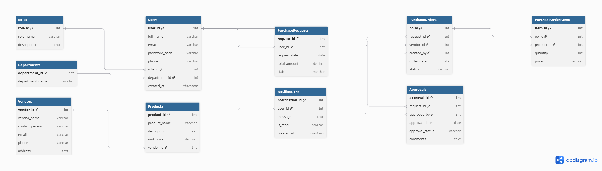

# Database Design

## 1. Introduction

The Purchase Order Management System (POMS) uses a managed PostgreSQL 15+ relational database (`purchase_order_db`) hosted on Neon. The database design enforces data integrity, foreign key constraints, unique indexing, and auto-incrementing primary keys across 8 normalized tables.

---

## 2. Database Overview

- **Engine**: PostgreSQL 15+ (Hosted on Neon)
- **Database Name**: `purchase_order_db`
- **Default Schema**: `public`
- **Connection**: Encrypted TLS with connection pooling
- **Driver**: PostgreSQL JDBC Driver (via Spring Data JPA / Hibernate)
- **Schema File**: `database/schema.sql`
- **Seed File**: `database/seed.sql`

---

## 3. Entity-Relationship (ER) Diagram

---

## 4. Detailed Entity Schema (8 Tables)

### 1. `users` Table

Stores user account records, credentials, and roles.

- `id` (SERIAL, PK): Auto-incrementing primary key
- `full_name` (VARCHAR(100), NOT NULL): User's full name
- `email` (VARCHAR(100), NOT NULL, UNIQUE): Account email / login identity
- `password` (VARCHAR(255), NOT NULL): Salted BCrypt password hash
- `role` (VARCHAR(20), NOT NULL): User authorization level (`'Admin'`, `'Manager'`, `'Employee'`)
- `status` (VARCHAR(20), DEFAULT 'Active'): Account state (`'Active'`, `'Inactive'`)
- `created_at` (TIMESTAMP, DEFAULT CURRENT_TIMESTAMP): Registration timestamp

### 2. `vendors` Table

Stores registered supplier profiles and contact data.

- `id` (SERIAL, PK): Auto-incrementing primary key
- `vendor_name` (VARCHAR(150), NOT NULL): Company name
- `contact_person` (VARCHAR(100), NULL): Primary contact name
- `email` (VARCHAR(100), NULL): Contact email
- `phone` (VARCHAR(20), NULL): Contact phone number
- `address` (TEXT, NULL): Physical address
- `gst_number` (VARCHAR(30), NULL): GST tax identification number
- `status` (VARCHAR(20), DEFAULT 'Active'): Vendor operational status (`'Active'`, `'Inactive'`)
- `created_at` (TIMESTAMP, DEFAULT CURRENT_TIMESTAMP): Creation timestamp

### 3. `products` Table

Stores catalog items supplied by vendors.

- `id` (SERIAL, PK): Auto-incrementing primary key
- `vendor_id` (INT, NOT NULL, FK -> `vendors.id` ON DELETE CASCADE): Associated vendor ID
- `product_name` (VARCHAR(150), NOT NULL): Item name
- `category` (VARCHAR(100), NULL): Product category
- `description` (TEXT, NULL): Item specifications
- `unit_price` (NUMERIC(10,2), NOT NULL): Default unit cost
- `stock_quantity` (INT, DEFAULT 0, CHECK stock_quantity >= 0): Catalog stock quantity
- `unit` (VARCHAR(30), NULL): Unit of measurement (e.g., Piece, Box)
- `status` (VARCHAR(20), DEFAULT 'Available'): Catalog availability (`'Available'`, `'Unavailable'`)
- `created_at` (TIMESTAMP, DEFAULT CURRENT_TIMESTAMP): Creation timestamp

### 4. `purchase_orders` Table

Stores purchase order headers.

- `id` (SERIAL, PK): Auto-incrementing primary key
- `po_number` (VARCHAR(30), NOT NULL, UNIQUE): Human-readable order identifier (e.g., `PO1001`)
- `vendor_id` (INT, NOT NULL, FK -> `vendors.id`): Selected supplier
- `order_date` (DATE, NOT NULL): Order creation date
- `expected_delivery` (DATE, NULL): Target delivery date
- `total_amount` (NUMERIC(12,2), DEFAULT 0.00): Aggregated order cost
- `status` (VARCHAR(20), DEFAULT 'Pending'): Order lifecycle state (`'Pending'`, `'Approved'`, `'Rejected'`, `'Completed'`)
- `created_by` (INT, NULL, FK -> `users.id`): Purchasing user ID
- `created_at` (TIMESTAMP, DEFAULT CURRENT_TIMESTAMP): Record timestamp

### 5. `purchase_order_items` Table

Stores itemized line items associated with purchase orders (JPA Composite Key).

- `id` (SERIAL): Line sequence identifier
- `purchase_order_id` (INT, NOT NULL, FK -> `purchase_orders.id` ON DELETE CASCADE): Order header
- `product_id` (INT, NOT NULL, FK -> `products.id`): Ordered catalog product
- `quantity` (INT, NOT NULL): Ordered quantity
- `unit_price` (NUMERIC(10,2), NOT NULL): Unit price at purchase
- `total_price` (NUMERIC(12,2), GENERATED ALWAYS AS ((quantity::NUMERIC * unit_price)) STORED): Computed item total
- *Primary Key*: Composite `(purchase_order_id, product_id)`

### 6. `inventory` Table

Monitors warehouse stock and reorder thresholds.

- `id` (SERIAL, PK): Auto-incrementing primary key
- `product_id` (INT, NOT NULL, UNIQUE, FK -> `products.id` ON DELETE CASCADE): Product reference
- `quantity_in_stock` (INT, DEFAULT 0, CHECK quantity_in_stock >= 0): Current warehouse stock
- `reorder_level` (INT, DEFAULT 10): Minimum threshold before reorder alert
- `last_updated` (TIMESTAMP, DEFAULT CURRENT_TIMESTAMP): Last stock update timestamp

### 7. `goods_receipts` Table

Tracks delivery verification receipt headers.

- `id` (SERIAL, PK): Auto-incrementing primary key
- `gr_number` (VARCHAR(30), NOT NULL, UNIQUE): Human-readable receipt identifier (e.g., `GR1001`)
- `purchase_order_id` (INT, NOT NULL, FK -> `purchase_orders.id`): Delivered purchase order
- `received_date` (DATE, NOT NULL): Date items were delivered
- `received_by` (INT, NOT NULL, FK -> `users.id`): Receiving personnel user ID
- `remarks` (VARCHAR(255), NULL): Inspection remarks or notes
- `created_at` (TIMESTAMP, DEFAULT CURRENT_TIMESTAMP): Record creation timestamp

### 8. `goods_receipt_items` Table

Source-of-truth line items capturing individual delivered product quantities.

- `id` (SERIAL, PK): Auto-incrementing primary key
- `goods_receipt_id` (INT, NOT NULL, FK -> `goods_receipts.id` ON DELETE CASCADE): Parent receipt header
- `product_id` (INT, NOT NULL, FK -> `products.id` ON DELETE RESTRICT): Received catalog product
- `received_quantity` (INT, NOT NULL, CHECK received_quantity > 0): Actual delivered quantity
- `created_at` (TIMESTAMP, DEFAULT CURRENT_TIMESTAMP): Timestamp of receipt entry
- *Unique Constraint*: `UNIQUE (goods_receipt_id, product_id)`

---

## 5. Foreign Key Relational Summary

| Child Table | Foreign Key Field | Parent Table | Parent Key | Constraint Rule |
| :--- | :--- | :--- | :--- | :--- |
| `products` | `vendor_id` | `vendors` | `id` | ON DELETE CASCADE |
| `purchase_orders` | `vendor_id` | `vendors` | `id` | RESTRICT |
| `purchase_orders` | `created_by` | `users` | `id` | RESTRICT |
| `purchase_order_items` | `purchase_order_id` | `purchase_orders` | `id` | ON DELETE CASCADE |
| `purchase_order_items` | `product_id` | `products` | `id` | RESTRICT |
| `inventory` | `product_id` | `products` | `id` | ON DELETE CASCADE |
| `goods_receipts` | `purchase_order_id` | `purchase_orders` | `id` | RESTRICT |
| `goods_receipts` | `received_by` | `users` | `id` | RESTRICT |
| `goods_receipt_items` | `goods_receipt_id` | `goods_receipts` | `id` | ON DELETE CASCADE |
| `goods_receipt_items` | `product_id` | `products` | `id` | ON DELETE RESTRICT |