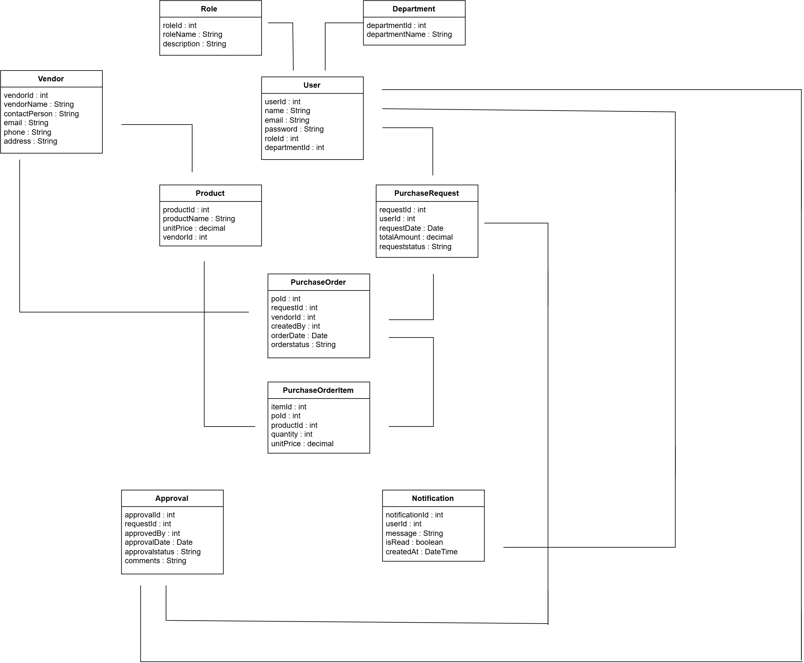

# Class Diagram

## Introduction

The UML Class Diagram represents the static structure of the Purchase Order Management System by illustrating the classes, attributes, and relationships among system entities.

## Diagram

## Description

The diagram models the major entities involved in the procurement workflow, including users, departments, roles, vendors, products, purchase requests, purchase orders, approvals, and notifications.

## Conclusion

The class diagram serves as the blueprint for implementing the backend classes and business logic.