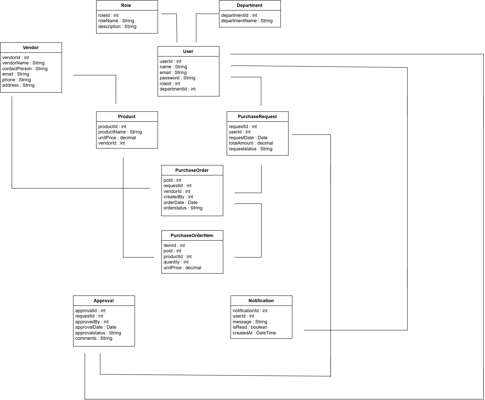

# Class Diagram & Module Structure

## 1. Introduction

The Class and Module Structure describes the static organization of the Purchase Order Management System (POMS), representing the relationship between controllers, middleware, data services, and database entities.

---

## 2. Diagram Reference

---

## 3. Class & Component Specifications

### 1. REST Controllers (`com.poms.backend.controller`)

- `AuthController`: Handles user login (`POST /api/login`) and profile retrieval (`GET /api/me`).
- `DashboardController`: Aggregates real-time procurement KPI counts and operational alerts (`GET /api/dashboard/stats`).
- `VendorController`: Manages vendor directory retrieval and Admin/Manager CRUD operations.
- `ProductController`: Manages product catalog retrieval and Admin/Manager CRUD operations.
- `PurchaseOrderController`: Manages order creation, receiving balances, item details, editing, cancellation, and status transitions.
- `InventoryController`: Manages warehouse inventory queries and low-stock alerts.
- `GoodsReceiptController`: Manages receipt entry (`POST /api/goods-receipts`) and delivery log retrieval.
- `HealthController`: Exposes automated uptime verification (`GET /api/health`).

### 2. Service Layer (`com.poms.backend.service`)

- `UserService`: User account lookup by email and ID.
- `DashboardService`: Aggregates KPI statistics from database repositories.
- `VendorService`: Vendor business logic, duplicate checks, and soft deactivation.
- `ProductService`: Product catalog business logic, vendor association, and availability updates.
- `PurchaseOrderService`: Transactional multi-item PO creation, total calculation, and status workflow transitions.
- `InventoryService`: Warehouse stock level queries and reorder status computations.
- `GoodsReceiptService`: Transactional delivery receipt processing, itemized receiving balance validation, and automatic inventory incrementation.

### 3. Repository Layer (`com.poms.backend.repository`)

- Spring Data JPA repositories extending `JpaRepository` with custom finder methods:
  - `UserRepository`, `VendorRepository`, `ProductRepository`, `PurchaseOrderRepository`, `PurchaseOrderItemRepository`, `InventoryRepository`, `GoodsReceiptRepository`, `GoodsReceiptItemRepository`.

### 4. Entity Models (`com.poms.backend.entity`)

- JPA mapped entities representing the 8 PostgreSQL tables:
  - `User`, `Vendor`, `Product`, `PurchaseOrder`, `PurchaseOrderItem` (with `PurchaseOrderItemId` composite key), `Inventory`, `GoodsReceipt`, `GoodsReceiptItem`.

### 5. Security & Authentication (`com.poms.backend.security`)

- `SecurityConfig`: Configures CORS, stateless session management, CSRF disabling, and endpoint RBAC rules.
- `CustomUserDetailsService`: Bridges database `users` records to Spring Security `UserDetails`.
- `JwtFilter`: Intercepts protected requests to validate JWT Bearer tokens and establish authentication context.
- `JwtUtil`: Handles HMAC-SHA256 token generation and claim extraction.

### 6. Client-Side Services & Context (`frontend/src/`)

- `api.js`: Axios instance configured with JWT request interceptor and global 401 redirection handler.
- `AuthContext.jsx` / `useAuth.js`: React context provider managing token persistence, user profile caching, and permission flags (`isAdmin`, `isManager`, `isEmployee`, `canManageVendors`, `canManageProducts`, `canManagePurchaseOrders`, `canReceiveGoods`).